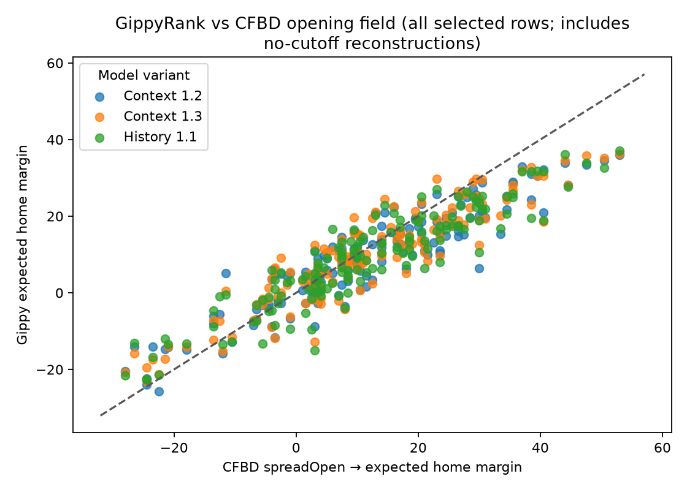
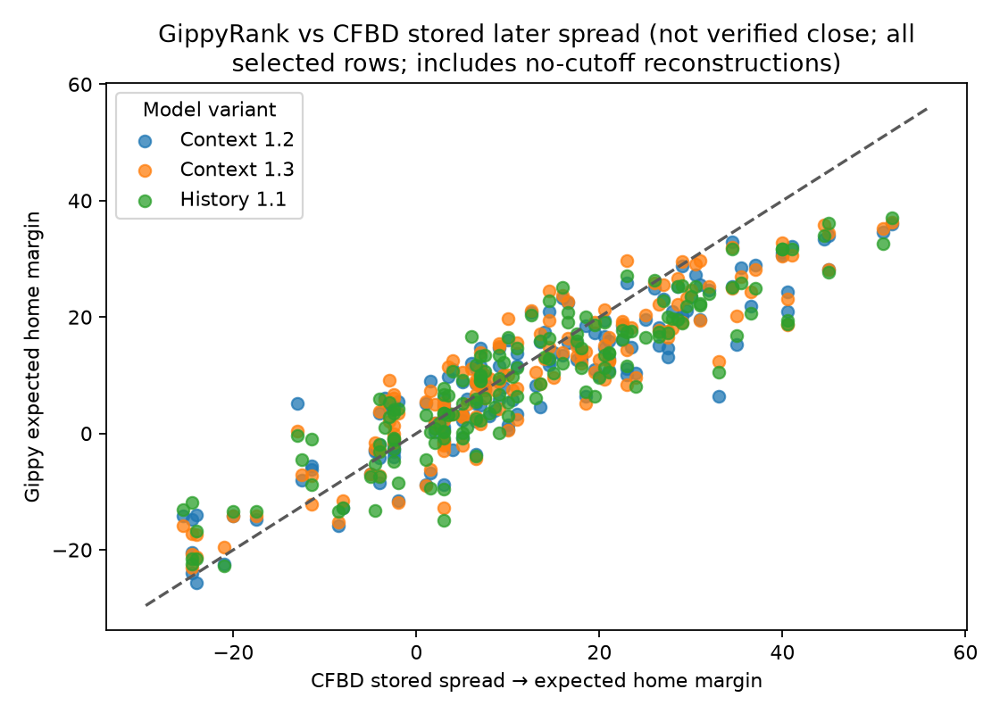
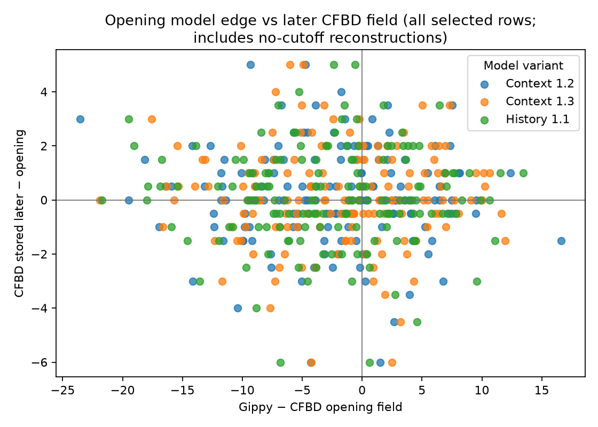
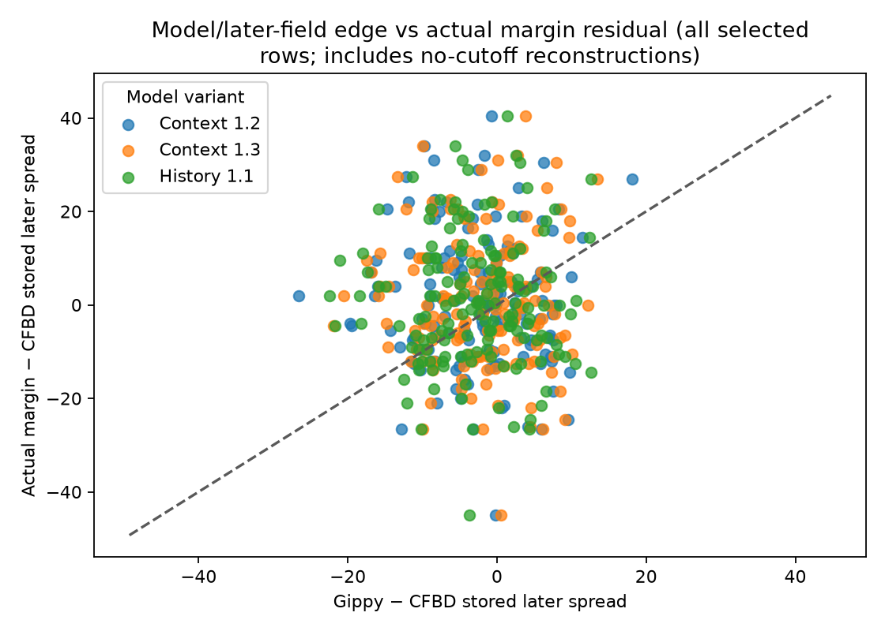
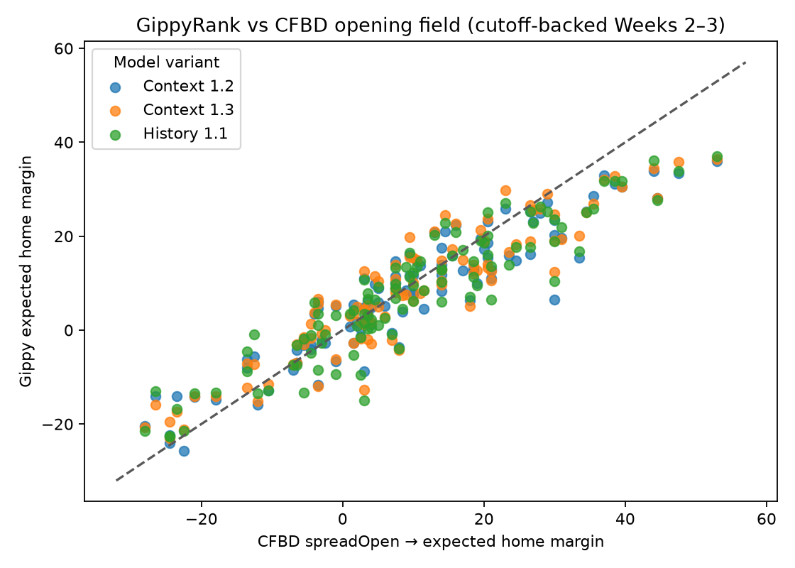
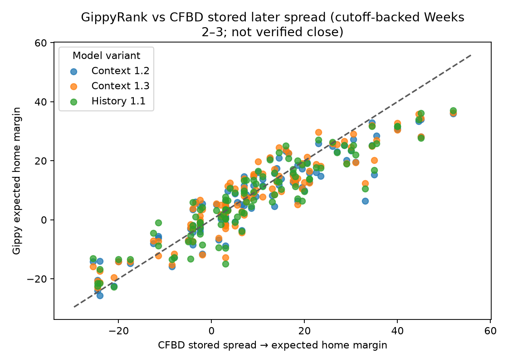
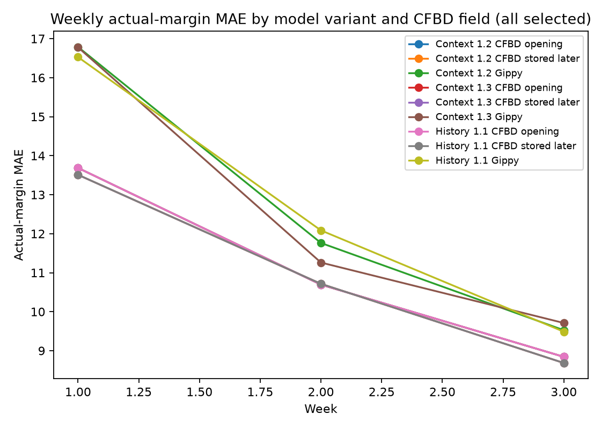

# 2026 model-variant versus CFBD-field retrospective (2026)

## Bottom line

This is an explicitly labelled historical reconstruction. It asks how History 1.1, Context 1.2, and Context 1.3 artifacts would have scored against final margins, even when an artifact was materialized after the games. Generation timestamps are retained in every output and are not silently treated as pregame publication times.

There is no Context 1.1 artifact: the baseline is correctly named **History 1.1** and selected from `prior_family=history`, `history_prior=1.1`, with its canonical Context 1.2 lineage. Context 1.3 Week 2/3 replays are included by request and visibly labelled as postgame-generated reconstructions.

This analysis cannot establish true historical opening-to-closing market movement. CFBD supplies a mutable, timestamp-free `spread` per provider; spot checks show it does not reliably equal the last pre-kickoff quote. Thus `CFBD opening` and `CFBD stored later` are endpoint fields for diagnostics, not validated historical opening and closing lines.

## Compact summary

### All selected rows

| Variant | N | MAD vs CFBD open | MAD vs CFBD later | Mean move toward Gippy | Gippy actual MAE | Paired MAE − open | Paired MAE − later |
| --- | --- | --- | --- | --- | --- | --- | --- |
| History 1.1 | 157 | 5.87 | 6.11 | -0.24 | 12.58 | 1.59 | 1.70 |
| Context 1.2 | 157 | 5.64 | 5.93 | -0.28 | 12.58 | 1.59 | 1.70 |
| Context 1.3 | 157 | 5.51 | 5.74 | -0.23 | 12.49 | 1.50 | 1.60 |

The all-selected table reports FBS-v-FBS games only and includes 153 Week 1 variant-game rows (51 shared games across three variants) without an effective-cutoff timestamp. `CFBD later` is a stored-line diagnostic, not a closing-market claim; paired MAE is model absolute error minus the benchmark on identical games (negative favors the model).

### Cutoff-backed sensitivity (Weeks 2–3)

| Variant | N | MAD vs CFBD open | MAD vs CFBD later | Mean move toward Gippy | Gippy actual MAE | Paired MAE − open | Paired MAE − later |
| --- | --- | --- | --- | --- | --- | --- | --- |
| History 1.1 | 106 | 5.46 | 5.45 | 0.00 | 10.69 | 0.99 | 1.06 |
| Context 1.2 | 106 | 5.27 | 5.18 | 0.09 | 10.56 | 0.86 | 0.94 |
| Context 1.3 | 106 | 5.37 | 5.21 | 0.17 | 10.43 | 0.73 | 0.80 |

This sensitivity excludes the Week 1 preseason reconstruction rows with no effective-cutoff timestamp. It still includes Context 1.3’s postgame-materialized artifacts, which have an earlier effective cutoff and are labelled as reconstructions rather than contemporaneous publications.

## Direct answers

- **Historical opening/closing question:** not answered with this CFBD feed. The endpoint fields lack the timestamps and history needed to prove true market opening, closing, or movement.
- **Outcome accuracy:** model and CFBD-field errors below are calculated against the final home margin on identical FBS-v-FBS games.
- **History 1.1:** model actual-margin MAE 12.58; CFBD opening-field MAE 10.99; CFBD stored-later-field MAE 10.89; stored-field distance change toward model -0.24; opening-edge/actual-residual Pearson -0.01.
- **Context 1.2:** model actual-margin MAE 12.58; CFBD opening-field MAE 10.99; CFBD stored-later-field MAE 10.89; stored-field distance change toward model -0.28; opening-edge/actual-residual Pearson -0.06.
- **Context 1.3:** model actual-margin MAE 12.49; CFBD opening-field MAE 10.99; CFBD stored-later-field MAE 10.89; stored-field distance change toward model -0.23; opening-edge/actual-residual Pearson -0.01.
- **Common-game comparison:** 157 games; all requested variants are present.

## Artifact selection and timing provenance

For reconstruction, weekly/live artifacts still need an effective cutoff before the target week's first kickoff. Week 1 preseason artifacts have no effective-cutoff timestamp, so they are retained as **unverified historical reconstructions**, not as contemporaneous predictions.

| Variant | Family | Model version | Week | Selected snapshot | Status | Generated | Cutoff | Timing class | Source retrieved | Source Context snapshot | Comparison snapshot | Missing reason |
| --- | --- | --- | --- | --- | --- | --- | --- | --- | --- | --- | --- | --- |
| History 1.1 | history | 1.1 | 1 | `2026-preseason-history` | official | 2026-09-05T20:12:57.082967Z | — | reconstruction_without_effective_cutoff | — | `2026-preseason-context` | — | — |
| Context 1.2 | context | 1.2 | 1 | `2026-preseason-context` | official | 2026-09-05T20:12:56.196105Z | — | reconstruction_without_effective_cutoff | — | `2026-preseason-context` | — | — |
| Context 1.3 | context | 1.3 | 1 | `2026-preseason-context-v1.3` | official | 2026-09-19T22:12:15.043275Z | — | reconstruction_without_effective_cutoff | — | `2026-preseason-context-v1.3` | — | — |
| History 1.1 | history | 1.1 | 2 | `2026-weekly-2026-09-08T11-43-00.275833Z-history` | official | 2026-09-08T11:43:00.275833Z | 2026-09-08T11:43:00.275833Z | pregame_artifact_in_reconstruction_study | 2026-09-08T11:43:00.275833Z | `2026-weekly-2026-09-08T11-43-00.275833Z-context` | `2026-preseason-history-context-1.3` | — |
| Context 1.2 | context | 1.2 | 2 | `2026-weekly-2026-09-08T11-43-00.275833Z-context` | official | 2026-09-08T11:43:00.275833Z | 2026-09-08T11:43:00.275833Z | pregame_artifact_in_reconstruction_study | 2026-09-08T11:43:00.275833Z | `2026-weekly-2026-09-08T11-43-00.275833Z-context` | `2026-preseason-context` | — |
| Context 1.3 | context | 1.3 | 2 | `2026-weekly-2026-09-08T11-43-00.275833Z-context-v1.3` | official | 2026-09-20T12:00:00Z | 2026-09-08T11:43:00.275833Z | postgame_generated_reconstruction_with_pregame_cutoff | 2026-09-08T11:43:00.275833Z | `2026-weekly-2026-09-08T11-43-00.275833Z-context-v1.3` | `2026-preseason-context-v1.3` | — |
| History 1.1 | history | 1.1 | 3 | `2026-weekly-2026-09-13T12-02-55.255941Z-history` | official | 2026-09-13T12:02:55.255941Z | 2026-09-13T12:02:55.255941Z | pregame_artifact_in_reconstruction_study | 2026-09-13T12:02:55.255941Z | `2026-weekly-2026-09-13T12-02-55.255941Z-context` | `2026-weekly-2026-09-08T11-43-00.275833Z-history` | — |
| Context 1.2 | context | 1.2 | 3 | `2026-weekly-2026-09-13T12-02-55.255941Z-context` | official | 2026-09-13T12:02:55.255941Z | 2026-09-13T12:02:55.255941Z | pregame_artifact_in_reconstruction_study | 2026-09-13T12:02:55.255941Z | `2026-weekly-2026-09-13T12-02-55.255941Z-context` | `2026-weekly-2026-09-08T11-43-00.275833Z-context` | — |
| Context 1.3 | context | 1.3 | 3 | `2026-weekly-2026-09-13T12-02-55.255941Z-context-v1.3` | official | 2026-09-20T12:00:00Z | 2026-09-13T12:02:55.255941Z | postgame_generated_reconstruction_with_pregame_cutoff | 2026-09-13T12:02:55.255941Z | `2026-weekly-2026-09-13T12-02-55.255941Z-context-v1.3` | `2026-weekly-2026-09-08T11-43-00.275833Z-context-v1.3` | — |

### Interpretation of timing classes

- `published_before_target_week_start` is a contemporaneously generated source artifact.
- `postgame_generated_reconstruction_with_pregame_cutoff` has a pregame evidence cutoff but was generated later; use it only for this counterfactual reconstruction.
- `reconstruction_without_effective_cutoff` is the Week 1 preseason case: it is retained at the user's request but cannot prove what information was available before the first Week 1 kickoff.

## CFBD endpoint fields and provider policy

CFBD `/lines` records `formattedSpread`, `spreadOpen`, and `spread` under an exact provider display string but provides no provider id, observation timestamps, or historical sequence. `spread` is home-oriented in CFBD's sign convention (`Home -7` is `-7`), so this study negates it to the canonical expected home margin (`+7`). Pick'em remains zero. `DraftKings` and `Draft Kings` are retained as distinct raw provider names; they are never silently merged.

The source-provided `spreadOpen` is called the **CFBD opening field** and `spread` the **CFBD stored later field**. Neither supplies enough evidence to answer a genuine first-quote, closing-line, or market-response question.

For compatibility with the original requested schema, the per-game `closing_home_margin` column is a duplicate alias of `cfbd_later_home_margin`; despite that legacy name, it is **not** a verified closing line.

### Candidate model-game population used for provider selection

| Week | Unique FBS-v-FBS model games |
| --- | --- |
| 1 | 51 |
| 2 | 49 |
| 3 | 57 |
| All weeks (unique) | 157 |

| Provider | Eligible | Open | Stored later | Same-provider open/later |
| --- | --- | --- | --- | --- |
| Bovada (selected) | 157 | 157 | 157 | 157 |
| Draft Kings | 157 | 0 | 157 | 0 |
| DraftKings | 157 | 151 | 157 | 151 |

Selection rationale: DraftKings is not the maximum-coverage provider; selected Bovada deterministically from providers with 157 comparable games.

### Provider coverage by model-game week

| Week | Candidate model games | Provider | Eligible | Open | Stored later | Same-provider open/later |
| --- | --- | --- | --- | --- | --- | --- |
| 1 | 51 | Bovada (selected) | 51 | 51 | 51 | 51 |
| 1 | 51 | Draft Kings | 51 | 0 | 51 | 0 |
| 1 | 51 | DraftKings | 51 | 45 | 51 | 45 |
| 2 | 49 | Bovada (selected) | 49 | 49 | 49 | 49 |
| 2 | 49 | Draft Kings | 49 | 0 | 49 | 0 |
| 2 | 49 | DraftKings | 49 | 49 | 49 | 49 |
| 3 | 57 | Bovada (selected) | 57 | 57 | 57 | 57 |
| 3 | 57 | Draft Kings | 57 | 0 | 57 | 0 |
| 3 | 57 | DraftKings | 57 | 57 | 57 | 57 |

### Manual, non-reproducible CFBD spread observations

The following manual observations were used only to test whether a closing-line interpretation was safe. The study did not capture archival quote payloads or retrieval timestamps, so they are **not** reproducible semantic verification and are not used as a second market feed. Mixed observations are enough to leave both CFBD field semantics unverified:

- [Boston College at Cincinnati (401856777, Week 1)](https://theoddsgap.com/odds/college-football/boston-college-eagles-vs-cincinnati-bearcats): CFBD's DraftKings and Bovada stored spreads both matched the archived last pre-kickoff quote.
- [SMU at Florida State (401858212, Week 1)](https://theoddsgap.com/odds/college-football/smu-mustangs-vs-florida-state-seminoles): CFBD DraftKings showed SMU -3 while the archived DraftKings close was SMU -4.5; Bovada matched at SMU -3.
- [Oregon at Oklahoma State (401856782, Week 2)](https://theoddsgap.com/odds/college-football/oregon-ducks-vs-oklahoma-state-cowboys/2026-09-12): CFBD DraftKings and Bovada values both differed from their archived per-book last pre-kickoff quotes.
- [Florida State at Alabama (401856685, Week 3)](https://theoddsgap.com/odds/college-football/florida-state-seminoles-vs-alabama-crimson-tide/2026-09-19): CFBD DraftKings matched the archived close; CFBD Bovada differed by one point.

## Data-quality diagnostics

| Variant | Week | Timing class | Expected | Gippy | Open | Later | Same book | Final | Retained | Nonfuture source rows | Book |
| --- | --- | --- | --- | --- | --- | --- | --- | --- | --- | --- | --- |
| History 1.1 | 1 | reconstruction_without_effective_cutoff | 51 | 51 | 51 | 51 | 51 | 51 | 51 | 0 | Bovada |
| Context 1.2 | 1 | reconstruction_without_effective_cutoff | 51 | 51 | 51 | 51 | 51 | 51 | 51 | 0 | Bovada |
| Context 1.3 | 1 | reconstruction_without_effective_cutoff | 51 | 51 | 51 | 51 | 51 | 51 | 51 | 0 | Bovada |
| History 1.1 | 2 | pregame_artifact_in_reconstruction_study | 49 | 49 | 49 | 49 | 49 | 49 | 49 | 0 | Bovada |
| Context 1.2 | 2 | pregame_artifact_in_reconstruction_study | 49 | 49 | 49 | 49 | 49 | 49 | 49 | 0 | Bovada |
| Context 1.3 | 2 | postgame_generated_reconstruction_with_pregame_cutoff | 49 | 49 | 49 | 49 | 49 | 49 | 49 | 0 | Bovada |
| History 1.1 | 3 | pregame_artifact_in_reconstruction_study | 57 | 57 | 57 | 57 | 57 | 57 | 57 | 0 | Bovada |
| Context 1.2 | 3 | pregame_artifact_in_reconstruction_study | 57 | 57 | 57 | 57 | 57 | 57 | 57 | 0 | Bovada |
| Context 1.3 | 3 | postgame_generated_reconstruction_with_pregame_cutoff | 57 | 57 | 57 | 57 | 57 | 57 | 57 | 0 | Bovada |

### Exclusion screens

| Variant | Week | Expected FBS | No selected artifact | No Gippy prediction | No same-book fields | No final score | Retained |
| --- | --- | --- | --- | --- | --- | --- | --- |
| History 1.1 | 1 | 51 | 0 | 0 | 0 | 0 | 51 |
| Context 1.2 | 1 | 51 | 0 | 0 | 0 | 0 | 51 |
| Context 1.3 | 1 | 51 | 0 | 0 | 0 | 0 | 51 |
| History 1.1 | 2 | 49 | 0 | 0 | 0 | 0 | 49 |
| Context 1.2 | 2 | 49 | 0 | 0 | 0 | 0 | 49 |
| Context 1.3 | 2 | 49 | 0 | 0 | 0 | 0 | 49 |
| History 1.1 | 3 | 57 | 0 | 0 | 0 | 0 | 57 |
| Context 1.2 | 3 | 57 | 0 | 0 | 0 | 0 | 57 |
| Context 1.3 | 3 | 57 | 0 | 0 | 0 | 0 | 57 |

Exclusion screens are diagnostic and may overlap; they are not meant to sum to the expected count.

`primary retained` requires an FBS-v-FBS model prediction, same-book CFBD opening/stored-later fields, and a final score. Lower-division games remain outside the headline sample; all joins use stable CFBD game ids. The source game state and timing classification are retained per row for auditability.

## CFBD-field alignment (a similarity question, not accuracy)

| Variant | Endpoint | N | Mean abs | Median abs | RMSE | Signed | Pearson | Spearman | Same favorite | ≤3 | ≤5 | ≤7 |
| --- | --- | --- | --- | --- | --- | --- | --- | --- | --- | --- | --- | --- |
| History 1.1 | CFBD opening | 157 | 5.87 | 4.77 | 7.41 | -2.62 | 0.92 | 0.92 | 91.7% | 29.9% | 52.2% | 64.3% |
| History 1.1 | CFBD stored later | 157 | 6.11 | 4.96 | 7.68 | -2.74 | 0.91 | 0.91 | 90.4% | 29.9% | 51.0% | 64.3% |
| Context 1.2 | CFBD opening | 157 | 5.64 | 4.76 | 7.23 | -2.48 | 0.92 | 0.91 | 91.7% | 35.7% | 51.6% | 66.9% |
| Context 1.2 | CFBD stored later | 157 | 5.93 | 5.09 | 7.56 | -2.60 | 0.91 | 0.90 | 90.4% | 33.1% | 49.0% | 61.8% |
| Context 1.3 | CFBD opening | 157 | 5.51 | 4.91 | 6.99 | -1.96 | 0.92 | 0.91 | 89.8% | 32.5% | 50.3% | 70.1% |
| Context 1.3 | CFBD stored later | 157 | 5.74 | 5.01 | 7.26 | -2.08 | 0.91 | 0.91 | 88.5% | 31.8% | 49.7% | 66.2% |

| Variant | Endpoint | Intercept | Slope | R² |
| --- | --- | --- | --- | --- |
| History 1.1 | CFBD opening | 0.94 | 1.19 | 0.84 |
| History 1.1 | CFBD stored later | 1.24 | 1.17 | 0.82 |
| Context 1.2 | CFBD opening | 0.71 | 1.20 | 0.85 |
| Context 1.2 | CFBD stored later | 1.03 | 1.17 | 0.83 |
| Context 1.3 | CFBD opening | 0.38 | 1.16 | 0.85 |
| Context 1.3 | CFBD stored later | 0.68 | 1.15 | 0.83 |

## CFBD-field change diagnostic (not historical market movement)

| Variant | N | Mean open dist | Mean later dist | Median open dist | Median later dist | Mean toward | Toward | Away | Unchanged |
| --- | --- | --- | --- | --- | --- | --- | --- | --- | --- |
| History 1.1 | 157 | 5.87 | 6.11 | 4.77 | 4.96 | -0.24 | 36.9% | 47.1% | 15.9% |
| Context 1.2 | 157 | 5.64 | 5.93 | 4.76 | 5.09 | -0.28 | 38.2% | 45.9% | 15.9% |
| Context 1.3 | 157 | 5.51 | 5.74 | 4.91 | 5.01 | -0.23 | 39.5% | 44.6% | 15.9% |

| Variant | N | Pearson | Spearman | Intercept | Slope | R² |
| --- | --- | --- | --- | --- | --- | --- |
| History 1.1 | 157 | -0.01 | -0.00 | 0.11 | -0.00 | 0.00 |
| Context 1.2 | 157 | -0.04 | 0.00 | 0.10 | -0.01 | 0.00 |
| Context 1.3 | 157 | -0.01 | 0.02 | 0.12 | -0.00 | 0.00 |

### History 1.1 opening-edge buckets

| abs(edge) | N | Mean toward | Moved toward | Mean later distance |
| --- | --- | --- | --- | --- |
| < 2 | 33 | -1.05 | 21.2% | 1.98 |
| 2–5 | 49 | 0.01 | 44.9% | 3.57 |
| 5–8 | 35 | 0.06 | 48.6% | 6.68 |
| 8+ | 40 | -0.14 | 30.0% | 12.14 |

### Context 1.2 opening-edge buckets

| abs(edge) | N | Mean toward | Moved toward | Mean later distance |
| --- | --- | --- | --- | --- |
| < 2 | 39 | -0.86 | 28.2% | 1.73 |
| 2–5 | 42 | -0.23 | 40.5% | 3.63 |
| 5–8 | 35 | 0.03 | 45.7% | 6.47 |
| 8+ | 41 | -0.06 | 39.0% | 11.81 |

### Context 1.3 opening-edge buckets

| abs(edge) | N | Mean toward | Moved toward | Mean later distance |
| --- | --- | --- | --- | --- |
| < 2 | 40 | -0.60 | 32.5% | 1.52 |
| 2–5 | 39 | -0.57 | 35.9% | 3.95 |
| 5–8 | 39 | 0.32 | 53.8% | 5.97 |
| 8+ | 39 | -0.05 | 35.9% | 11.61 |

A positive movement-toward value means the CFBD stored later field was closer to the model than the CFBD opening field. This is descriptive association only; it is not evidence of an actual market move, causal influence, or a verified open/close sequence.

## Actual-margin predictive performance

| Variant | Prediction/comparison | N | MAE / mean Δ | Median abs / Δ | RMSE / CI | Signed | Pearson | Spearman |
| --- | --- | --- | --- | --- | --- | --- | --- | --- |
| History 1.1 | Gippy | 157 | 12.58 | 9.64 | 16.14 | -3.57 | 0.65 | 0.63 |
| History 1.1 | CFBD opening | 157 | 10.99 | 9.00 | 14.09 | -0.96 | 0.73 | 0.72 |
| History 1.1 | CFBD stored later | 157 | 10.89 | 9.00 | 13.97 | -0.83 | 0.74 | 0.73 |
| History 1.1 | Gippy − CFBD open paired | 157 | 1.59 | 1.39 | [0.57, 2.65] | — | — | — |
| History 1.1 | Gippy − CFBD later paired | 157 | 1.70 | 1.64 | [0.65, 2.77] | — | — | — |
| Context 1.2 | Gippy | 157 | 12.58 | 9.79 | 16.32 | -3.43 | 0.64 | 0.62 |
| Context 1.2 | CFBD opening | 157 | 10.99 | 9.00 | 14.09 | -0.96 | 0.73 | 0.72 |
| Context 1.2 | CFBD stored later | 157 | 10.89 | 9.00 | 13.97 | -0.83 | 0.74 | 0.73 |
| Context 1.2 | Gippy − CFBD open paired | 157 | 1.59 | 0.74 | [0.57, 2.61] | — | — | — |
| Context 1.2 | Gippy − CFBD later paired | 157 | 1.70 | 1.31 | [0.66, 2.75] | — | — | — |
| Context 1.3 | Gippy | 157 | 12.49 | 9.54 | 15.91 | -2.92 | 0.65 | 0.64 |
| Context 1.3 | CFBD opening | 157 | 10.99 | 9.00 | 14.09 | -0.96 | 0.73 | 0.72 |
| Context 1.3 | CFBD stored later | 157 | 10.89 | 9.00 | 13.97 | -0.83 | 0.74 | 0.73 |
| Context 1.3 | Gippy − CFBD open paired | 157 | 1.50 | 1.39 | [0.52, 2.48] | — | — | — |
| Context 1.3 | Gippy − CFBD later paired | 157 | 1.60 | 0.98 | [0.61, 2.60] | — | — | — |

### Requested-variant common-game paired sample

| Variant | Common N | Gippy MAE | Open MAE | Later MAE | Gippy − open | Gippy − later |
| --- | --- | --- | --- | --- | --- | --- |
| History 1.1 | 157 | 12.58 | 10.99 | 10.89 | 1.59 | 1.70 |
| Context 1.2 | 157 | 12.58 | 10.99 | 10.89 | 1.59 | 1.70 |
| Context 1.3 | 157 | 12.49 | 10.99 | 10.89 | 1.50 | 1.60 |

Common-game count: 157. Every row above uses the same intersection of requested model variants, FBS-v-FBS games, same-provider fields, and final scores.

### Cutoff-backed common-game sensitivity

| Variant | Common N | Gippy MAE | Open MAE | Later MAE | Gippy − open | Gippy − later |
| --- | --- | --- | --- | --- | --- | --- |
| History 1.1 | 106 | 10.69 | 9.70 | 9.62 | 0.99 | 1.06 |
| Context 1.2 | 106 | 10.56 | 9.70 | 9.62 | 0.86 | 0.94 |
| Context 1.3 | 106 | 10.43 | 9.70 | 9.62 | 0.73 | 0.80 |

Common-game count: 106. Every row above uses the same intersection of requested model variants, FBS-v-FBS games, same-provider fields, and final scores.

## Did model/CFBD-field disagreement contain residual signal?

| Variant | Endpoint | N | Pearson | Spearman | Intercept | Slope | R² | Directional agreement |
| --- | --- | --- | --- | --- | --- | --- | --- | --- |
| History 1.1 | CFBD opening | 157 | -0.01 | -0.01 | 0.90 | -0.02 | 0.00 | 47.1% |
| History 1.1 | CFBD stored later | 157 | -0.01 | -0.01 | 0.79 | -0.02 | 0.00 | 45.9% |
| Context 1.2 | CFBD opening | 157 | -0.06 | -0.07 | 0.67 | -0.11 | 0.00 | 49.0% |
| Context 1.2 | CFBD stored later | 157 | -0.05 | -0.06 | 0.59 | -0.10 | 0.00 | 46.5% |
| Context 1.3 | CFBD opening | 157 | -0.01 | -0.02 | 0.91 | -0.02 | 0.00 | 50.3% |
| Context 1.3 | CFBD stored later | 157 | -0.01 | -0.02 | 0.79 | -0.02 | 0.00 | 47.1% |

### History 1.1 edge thresholds vs opening

| abs(edge) | N | Pearson | Spearman | Slope | Directional |
| --- | --- | --- | --- | --- | --- |
| ≥ 3.00 | 110 | -0.04 | -0.02 | -0.07 | 46.4% |
| ≥ 5.00 | 75 | 0.04 | 0.10 | 0.07 | 50.7% |
| ≥ 7.00 | 56 | 0.06 | 0.00 | 0.08 | 55.4% |
| ≥ 10.00 | 22 | 0.14 | -0.16 | 0.18 | 54.5% |

### History 1.1 edge thresholds vs CFBD stored later

| abs(edge) | N | Pearson | Spearman | Slope | Directional |
| --- | --- | --- | --- | --- | --- |
| ≥ 3.00 | 110 | -0.03 | -0.02 | -0.06 | 45.5% |
| ≥ 5.00 | 77 | -0.03 | 0.03 | -0.04 | 45.5% |
| ≥ 7.00 | 56 | 0.01 | -0.02 | 0.02 | 51.8% |
| ≥ 10.00 | 27 | 0.03 | -0.28 | 0.04 | 59.3% |

### Context 1.2 edge thresholds vs opening

| abs(edge) | N | Pearson | Spearman | Slope | Directional |
| --- | --- | --- | --- | --- | --- |
| ≥ 3.00 | 101 | -0.06 | -0.05 | -0.11 | 45.5% |
| ≥ 5.00 | 76 | -0.07 | -0.08 | -0.11 | 48.7% |
| ≥ 7.00 | 52 | 0.06 | 0.05 | 0.08 | 48.1% |
| ≥ 10.00 | 22 | 0.36 | 0.09 | 0.57 | 50.0% |

### Context 1.2 edge thresholds vs CFBD stored later

| abs(edge) | N | Pearson | Spearman | Slope | Directional |
| --- | --- | --- | --- | --- | --- |
| ≥ 3.00 | 105 | -0.08 | -0.13 | -0.13 | 43.8% |
| ≥ 5.00 | 80 | -0.05 | -0.08 | -0.08 | 42.5% |
| ≥ 7.00 | 60 | -0.06 | -0.04 | -0.08 | 40.0% |
| ≥ 10.00 | 24 | 0.34 | -0.12 | 0.52 | 58.3% |

### Context 1.3 edge thresholds vs opening

| abs(edge) | N | Pearson | Spearman | Slope | Directional |
| --- | --- | --- | --- | --- | --- |
| ≥ 3.00 | 106 | -0.01 | -0.00 | -0.02 | 45.3% |
| ≥ 5.00 | 78 | 0.05 | 0.04 | 0.07 | 52.6% |
| ≥ 7.00 | 47 | 0.06 | 0.05 | 0.08 | 51.1% |
| ≥ 10.00 | 24 | 0.16 | 0.08 | 0.19 | 45.8% |

### Context 1.3 edge thresholds vs CFBD stored later

| abs(edge) | N | Pearson | Spearman | Slope | Directional |
| --- | --- | --- | --- | --- | --- |
| ≥ 3.00 | 107 | -0.02 | -0.05 | -0.03 | 45.8% |
| ≥ 5.00 | 79 | -0.02 | -0.03 | -0.03 | 44.3% |
| ≥ 7.00 | 53 | 0.00 | -0.11 | 0.00 | 47.2% |
| ≥ 10.00 | 22 | 0.09 | -0.04 | 0.11 | 36.4% |

A positive slope/correlation would mean that, when a model put the home team higher than a CFBD endpoint field, actual margins tended to exceed that endpoint too. These are descriptive checks, not profitability estimates or evidence about a true historical market line.

## Weekly evolution

| Variant | Week | N | MAD open | MAD later | Gippy MAE | Mean toward | Later edge/result Pearson |
| --- | --- | --- | --- | --- | --- | --- | --- |
| History 1.1 | 1 | 51 | 6.73 | 7.48 | 16.53 | -0.75 | -0.05 |
| History 1.1 | 2 | 49 | 6.07 | 6.13 | 12.09 | -0.06 | 0.03 |
| History 1.1 | 3 | 57 | 4.93 | 4.87 | 9.49 | 0.06 | 0.08 |
| Context 1.2 | 1 | 51 | 6.43 | 7.48 | 16.79 | -1.05 | -0.11 |
| Context 1.2 | 2 | 49 | 5.88 | 5.83 | 11.76 | 0.05 | 0.04 |
| Context 1.2 | 3 | 57 | 4.74 | 4.62 | 9.53 | 0.12 | 0.01 |
| Context 1.3 | 1 | 51 | 5.79 | 6.84 | 16.78 | -1.04 | -0.09 |
| Context 1.3 | 2 | 49 | 5.58 | 5.50 | 11.26 | 0.08 | 0.10 |
| Context 1.3 | 3 | 57 | 5.20 | 4.95 | 9.71 | 0.25 | 0.05 |

## Largest model/CFBD-field disagreements

### Context 1.2 Week 1 — largest gaps vs CFBD opening

| Game | Gippy | CFBD open | CFBD later | Actual | Gippy/open | Gippy/later | Move | Flags |
| --- | --- | --- | --- | --- | --- | --- | --- | --- |
| North Texas at Indiana | Indiana -21.0 | Indiana -40.5 | Indiana -40.5 | Indiana -36.0 | -19.5 | -19.5 | +0.0 |  |
| Oklahoma State at Tulsa | Tulsa -5.1 | Oklahoma State -11.5 | Oklahoma State -13.0 | Tulsa -14.0 | +16.6 | +18.1 | -1.5 | model/CFBD-opening favorite inversion; model/CFBD-stored favorite inversion |
| Ball State at Ohio State | Ohio State -34.6 | Ohio State -50.5 | Ohio State -51.0 | Ohio State -53.0 | -15.9 | -16.4 | +0.5 |  |
| Missouri State at Texas A&M | Texas A&M -24.3 | Texas A&M -38.5 | Texas A&M -40.5 | Texas A&M -50.0 | -14.2 | -16.2 | +2.0 |  |
| Ohio at Nebraska | Nebraska -10.3 | Nebraska -23.5 | Nebraska -24.0 | Nebraska -28.0 | -13.2 | -13.7 | +0.5 |  |
| Kent State at South Carolina | South Carolina -21.8 | South Carolina -34.5 | South Carolina -36.5 | South Carolina -57.0 | -12.7 | -14.7 | +2.0 |  |
| Marshall at Penn State | Penn State -11.1 | Penn State -23.5 | Penn State -23.0 | Penn State -45.0 | -12.4 | -11.9 | -0.5 |  |
| UAB at Illinois | Illinois -15.1 | Illinois -27.5 | Illinois -26.5 | Illinois -19.0 | -12.4 | -11.4 | -1.0 |  |
| Western Michigan at Michigan | Michigan -14.7 | Michigan -26.5 | Michigan -27.5 | Michigan -1.0 | -11.8 | -12.8 | +1.0 |  |
| Washington State at Washington | Washington -10.0 | Washington -21.5 | Washington -23.0 | Washington -14.0 | -11.5 | -13.0 | +1.5 |  |

### Context 1.2 Week 1 — largest gaps vs CFBD stored later

| Game | Gippy | CFBD open | CFBD later | Actual | Gippy/open | Gippy/later | Move | Flags |
| --- | --- | --- | --- | --- | --- | --- | --- | --- |
| North Texas at Indiana | Indiana -21.0 | Indiana -40.5 | Indiana -40.5 | Indiana -36.0 | -19.5 | -19.5 | +0.0 |  |
| Oklahoma State at Tulsa | Tulsa -5.1 | Oklahoma State -11.5 | Oklahoma State -13.0 | Tulsa -14.0 | +16.6 | +18.1 | -1.5 | model/CFBD-opening favorite inversion; model/CFBD-stored favorite inversion |
| Ball State at Ohio State | Ohio State -34.6 | Ohio State -50.5 | Ohio State -51.0 | Ohio State -53.0 | -15.9 | -16.4 | +0.5 |  |
| Missouri State at Texas A&M | Texas A&M -24.3 | Texas A&M -38.5 | Texas A&M -40.5 | Texas A&M -50.0 | -14.2 | -16.2 | +2.0 |  |
| Kent State at South Carolina | South Carolina -21.8 | South Carolina -34.5 | South Carolina -36.5 | South Carolina -57.0 | -12.7 | -14.7 | +2.0 |  |
| Akron at Wake Forest | Wake Forest -13.2 | Wake Forest -22.5 | Wake Forest -27.5 | Wake Forest -22.0 | -9.3 | -14.3 | +5.0 | CFBD stored field moved ≥3 points away from model |
| Ohio at Nebraska | Nebraska -10.3 | Nebraska -23.5 | Nebraska -24.0 | Nebraska -28.0 | -13.2 | -13.7 | +0.5 |  |
| Washington State at Washington | Washington -10.0 | Washington -21.5 | Washington -23.0 | Washington -14.0 | -11.5 | -13.0 | +1.5 |  |
| Western Michigan at Michigan | Michigan -14.7 | Michigan -26.5 | Michigan -27.5 | Michigan -1.0 | -11.8 | -12.8 | +1.0 |  |
| Marshall at Penn State | Penn State -11.1 | Penn State -23.5 | Penn State -23.0 | Penn State -45.0 | -12.4 | -11.9 | -0.5 |  |

### Context 1.2 Week 2 — largest gaps vs CFBD opening

| Game | Gippy | CFBD open | CFBD later | Actual | Gippy/open | Gippy/later | Move | Flags |
| --- | --- | --- | --- | --- | --- | --- | --- | --- |
| Southern Miss at Auburn | Auburn -6.5 | Auburn -30.0 | Auburn -33.0 | Auburn -35.0 | -23.5 | -26.5 | +3.0 | CFBD stored field moved ≥3 points away from model |
| Louisiana Tech at LSU | LSU -15.3 | LSU -33.5 | LSU -35.0 | LSU -31.0 | -18.2 | -19.7 | +1.5 |  |
| Rice at Notre Dame | Notre Dame -28.1 | Notre Dame -44.5 | Notre Dame -45.0 | Notre Dame -52.0 | -16.4 | -16.9 | +0.5 |  |
| Charlotte at Ole Miss | Ole Miss -33.3 | Ole Miss -47.5 | Ole Miss -44.5 | Ole Miss -32.0 | -14.2 | -11.2 | -3.0 |  |
| Texas Tech at Oregon State | Texas Tech -14.1 | Texas Tech -26.5 | Texas Tech -25.5 | Texas Tech -11.0 | +12.4 | +11.4 | +1.0 |  |
| Sacramento State at Fresno State | Fresno State -6.3 | Fresno State -18.0 | Fresno State -18.5 | Fresno State -46.0 | -11.7 | -12.2 | +0.5 |  |
| App State at East Carolina | App State -3.6 | East Carolina -8.0 | East Carolina -6.5 | App State -3.0 | -11.6 | -10.1 | -1.5 | model/CFBD-opening favorite inversion; model/CFBD-stored favorite inversion |
| Louisiana at USC | USC -19.6 | USC -31.0 | USC -31.0 | USC -19.0 | -11.4 | -11.4 | +0.0 |  |
| Georgia Southern at Clemson | Clemson -11.1 | Clemson -21.0 | Clemson -19.5 | Clemson -15.0 | -9.9 | -8.4 | -1.5 |  |
| Penn State at Temple | Penn State -14.0 | Penn State -23.5 | Penn State -24.0 | Penn State -18.0 | +9.5 | +10.0 | -0.5 |  |

### Context 1.2 Week 2 — largest gaps vs CFBD stored later

| Game | Gippy | CFBD open | CFBD later | Actual | Gippy/open | Gippy/later | Move | Flags |
| --- | --- | --- | --- | --- | --- | --- | --- | --- |
| Southern Miss at Auburn | Auburn -6.5 | Auburn -30.0 | Auburn -33.0 | Auburn -35.0 | -23.5 | -26.5 | +3.0 | CFBD stored field moved ≥3 points away from model |
| Louisiana Tech at LSU | LSU -15.3 | LSU -33.5 | LSU -35.0 | LSU -31.0 | -18.2 | -19.7 | +1.5 |  |
| Rice at Notre Dame | Notre Dame -28.1 | Notre Dame -44.5 | Notre Dame -45.0 | Notre Dame -52.0 | -16.4 | -16.9 | +0.5 |  |
| Sacramento State at Fresno State | Fresno State -6.3 | Fresno State -18.0 | Fresno State -18.5 | Fresno State -46.0 | -11.7 | -12.2 | +0.5 |  |
| Texas Tech at Oregon State | Texas Tech -14.1 | Texas Tech -26.5 | Texas Tech -25.5 | Texas Tech -11.0 | +12.4 | +11.4 | +1.0 |  |
| Louisiana at USC | USC -19.6 | USC -31.0 | USC -31.0 | USC -19.0 | -11.4 | -11.4 | +0.0 |  |
| Charlotte at Ole Miss | Ole Miss -33.3 | Ole Miss -47.5 | Ole Miss -44.5 | Ole Miss -32.0 | -14.2 | -11.2 | -3.0 |  |
| App State at East Carolina | App State -3.6 | East Carolina -8.0 | East Carolina -6.5 | App State -3.0 | -11.6 | -10.1 | -1.5 | model/CFBD-opening favorite inversion; model/CFBD-stored favorite inversion |
| Penn State at Temple | Penn State -14.0 | Penn State -23.5 | Penn State -24.0 | Penn State -18.0 | +9.5 | +10.0 | -0.5 |  |
| North Dakota State at Air Force | North Dakota State -11.6 | North Dakota State -3.5 | North Dakota State -2.0 | North Dakota State -6.0 | -8.1 | -9.6 | +1.5 |  |

### Context 1.2 Week 3 — largest gaps vs CFBD opening

| Game | Gippy | CFBD open | CFBD later | Actual | Gippy/open | Gippy/later | Move | Flags |
| --- | --- | --- | --- | --- | --- | --- | --- | --- |
| Kent State at Ohio State | Ohio State -36.0 | Ohio State -53.0 | Ohio State -52.0 | Ohio State -56.0 | -17.0 | -16.0 | -1.0 |  |
| North Texas at Texas State | North Texas -8.8 | Texas State -3.0 | Texas State -3.0 | Texas State -14.0 | -11.8 | -11.8 | +0.0 | model/CFBD-opening favorite inversion; model/CFBD-stored favorite inversion |
| Akron at Minnesota | Minnesota -16.1 | Minnesota -26.5 | Minnesota -22.5 | Minnesota -34.0 | -10.4 | -6.4 | -4.0 |  |
| Western Kentucky at Indiana | Indiana -33.9 | Indiana -44.0 | Indiana -45.0 | Indiana -38.0 | -10.1 | -11.1 | +1.0 |  |
| Michigan State at Notre Dame | Notre Dame -20.2 | Notre Dame -30.0 | Notre Dame -29.0 | Notre Dame -17.0 | -9.8 | -8.8 | -1.0 |  |
| Eastern Michigan at Wisconsin | Wisconsin -14.8 | Wisconsin -24.5 | Wisconsin -23.5 | Wisconsin -44.0 | -9.7 | -8.7 | -1.0 |  |
| UConn at Southern Miss | Southern Miss -6.0 | UConn -3.5 | UConn -3.5 | UConn -28.0 | +9.5 | +9.5 | +0.0 | model/CFBD-opening favorite inversion; model/CFBD-stored favorite inversion |
| Northern Illinois at Arizona | Arizona -25.3 | Arizona -34.5 | Arizona -34.5 | Arizona -25.0 | -9.2 | -9.2 | +0.0 |  |
| Louisiana Tech at Baylor | Baylor -9.9 | Baylor -19.0 | Baylor -20.0 | Baylor -17.0 | -9.1 | -10.1 | +1.0 |  |
| Virginia Tech at Maryland | Maryland -4.7 | Virginia Tech -3.5 | Virginia Tech -2.5 | Virginia Tech -9.0 | +8.2 | +7.2 | +1.0 | model/CFBD-opening favorite inversion; model/CFBD-stored favorite inversion |

### Context 1.2 Week 3 — largest gaps vs CFBD stored later

| Game | Gippy | CFBD open | CFBD later | Actual | Gippy/open | Gippy/later | Move | Flags |
| --- | --- | --- | --- | --- | --- | --- | --- | --- |
| Kent State at Ohio State | Ohio State -36.0 | Ohio State -53.0 | Ohio State -52.0 | Ohio State -56.0 | -17.0 | -16.0 | -1.0 |  |
| North Texas at Texas State | North Texas -8.8 | Texas State -3.0 | Texas State -3.0 | Texas State -14.0 | -11.8 | -11.8 | +0.0 | model/CFBD-opening favorite inversion; model/CFBD-stored favorite inversion |
| Western Kentucky at Indiana | Indiana -33.9 | Indiana -44.0 | Indiana -45.0 | Indiana -38.0 | -10.1 | -11.1 | +1.0 |  |
| Louisiana Tech at Baylor | Baylor -9.9 | Baylor -19.0 | Baylor -20.0 | Baylor -17.0 | -9.1 | -10.1 | +1.0 |  |
| UConn at Southern Miss | Southern Miss -6.0 | UConn -3.5 | UConn -3.5 | UConn -28.0 | +9.5 | +9.5 | +0.0 | model/CFBD-opening favorite inversion; model/CFBD-stored favorite inversion |
| Northern Illinois at Arizona | Arizona -25.3 | Arizona -34.5 | Arizona -34.5 | Arizona -25.0 | -9.2 | -9.2 | +0.0 |  |
| Buffalo at Penn State | Penn State -31.1 | Penn State -38.5 | Penn State -40.0 | Penn State -42.0 | -7.4 | -8.9 | +1.5 |  |
| Michigan State at Notre Dame | Notre Dame -20.2 | Notre Dame -30.0 | Notre Dame -29.0 | Notre Dame -17.0 | -9.8 | -8.8 | -1.0 |  |
| Eastern Michigan at Wisconsin | Wisconsin -14.8 | Wisconsin -24.5 | Wisconsin -23.5 | Wisconsin -44.0 | -9.7 | -8.7 | -1.0 |  |
| UAB at Louisiana | Louisiana -14.6 | Louisiana -7.5 | Louisiana -7.0 | Louisiana -7.0 | +7.1 | +7.6 | -0.5 |  |

### Context 1.3 Week 1 — largest gaps vs CFBD opening

| Game | Gippy | CFBD open | CFBD later | Actual | Gippy/open | Gippy/later | Move | Flags |
| --- | --- | --- | --- | --- | --- | --- | --- | --- |
| North Texas at Indiana | Indiana -18.6 | Indiana -40.5 | Indiana -40.5 | Indiana -36.0 | -21.9 | -21.9 | +0.0 |  |
| Missouri State at Texas A&M | Texas A&M -23.1 | Texas A&M -38.5 | Texas A&M -40.5 | Texas A&M -50.0 | -15.4 | -17.4 | +2.0 |  |
| Ball State at Ohio State | Ohio State -35.2 | Ohio State -50.5 | Ohio State -51.0 | Ohio State -53.0 | -15.3 | -15.8 | +0.5 |  |
| Ohio at Nebraska | Nebraska -9.5 | Nebraska -23.5 | Nebraska -24.0 | Nebraska -28.0 | -14.0 | -14.5 | +0.5 |  |
| Washington State at Washington | Washington -8.4 | Washington -21.5 | Washington -23.0 | Washington -14.0 | -13.1 | -14.6 | +1.5 |  |
| Oklahoma State at Tulsa | Tulsa -0.4 | Oklahoma State -11.5 | Oklahoma State -13.0 | Tulsa -14.0 | +11.9 | +13.4 | -1.5 | model/CFBD-opening favorite inversion; model/CFBD-stored favorite inversion |
| SMU at Florida State | Florida State -9.1 | SMU -2.5 | SMU -3.0 | SMU -3.0 | +11.6 | +12.1 | -0.5 | model/CFBD-opening favorite inversion; model/CFBD-stored favorite inversion |
| Kent State at South Carolina | South Carolina -24.4 | South Carolina -34.5 | South Carolina -36.5 | South Carolina -57.0 | -10.1 | -12.1 | +2.0 |  |
| Central Michigan at New Mexico | New Mexico -2.4 | New Mexico -12.5 | New Mexico -11.0 | New Mexico -31.0 | -10.1 | -8.6 | -1.5 |  |
| UTEP at Oklahoma | Oklahoma -30.5 | Oklahoma -40.5 | Oklahoma -41.0 | Oklahoma -51.0 | -10.0 | -10.5 | +0.5 |  |

### Context 1.3 Week 1 — largest gaps vs CFBD stored later

| Game | Gippy | CFBD open | CFBD later | Actual | Gippy/open | Gippy/later | Move | Flags |
| --- | --- | --- | --- | --- | --- | --- | --- | --- |
| North Texas at Indiana | Indiana -18.6 | Indiana -40.5 | Indiana -40.5 | Indiana -36.0 | -21.9 | -21.9 | +0.0 |  |
| Missouri State at Texas A&M | Texas A&M -23.1 | Texas A&M -38.5 | Texas A&M -40.5 | Texas A&M -50.0 | -15.4 | -17.4 | +2.0 |  |
| Ball State at Ohio State | Ohio State -35.2 | Ohio State -50.5 | Ohio State -51.0 | Ohio State -53.0 | -15.3 | -15.8 | +0.5 |  |
| Washington State at Washington | Washington -8.4 | Washington -21.5 | Washington -23.0 | Washington -14.0 | -13.1 | -14.6 | +1.5 |  |
| Ohio at Nebraska | Nebraska -9.5 | Nebraska -23.5 | Nebraska -24.0 | Nebraska -28.0 | -14.0 | -14.5 | +0.5 |  |
| Oklahoma State at Tulsa | Tulsa -0.4 | Oklahoma State -11.5 | Oklahoma State -13.0 | Tulsa -14.0 | +11.9 | +13.4 | -1.5 | model/CFBD-opening favorite inversion; model/CFBD-stored favorite inversion |
| Kent State at South Carolina | South Carolina -24.4 | South Carolina -34.5 | South Carolina -36.5 | South Carolina -57.0 | -10.1 | -12.1 | +2.0 |  |
| SMU at Florida State | Florida State -9.1 | SMU -2.5 | SMU -3.0 | SMU -3.0 | +11.6 | +12.1 | -0.5 | model/CFBD-opening favorite inversion; model/CFBD-stored favorite inversion |
| Wisconsin at Notre Dame | Notre Dame -9.3 | Notre Dame -16.5 | Notre Dame -20.5 | Notre Dame -28.0 | -7.2 | -11.2 | +4.0 | CFBD stored field moved ≥3 points away from model |
| Akron at Wake Forest | Wake Forest -16.5 | Wake Forest -22.5 | Wake Forest -27.5 | Wake Forest -22.0 | -6.0 | -11.0 | +5.0 | CFBD stored field moved ≥3 points away from model |

### Context 1.3 Week 2 — largest gaps vs CFBD opening

| Game | Gippy | CFBD open | CFBD later | Actual | Gippy/open | Gippy/later | Move | Flags |
| --- | --- | --- | --- | --- | --- | --- | --- | --- |
| Southern Miss at Auburn | Auburn -12.4 | Auburn -30.0 | Auburn -33.0 | Auburn -35.0 | -17.6 | -20.6 | +3.0 | CFBD stored field moved ≥3 points away from model |
| Rice at Notre Dame | Notre Dame -28.2 | Notre Dame -44.5 | Notre Dame -45.0 | Notre Dame -52.0 | -16.3 | -16.8 | +0.5 |  |
| Louisiana Tech at LSU | LSU -20.1 | LSU -33.5 | LSU -35.0 | LSU -31.0 | -13.4 | -14.9 | +1.5 |  |
| Sacramento State at Fresno State | Fresno State -5.2 | Fresno State -18.0 | Fresno State -18.5 | Fresno State -46.0 | -12.8 | -13.3 | +0.5 |  |
| App State at East Carolina | App State -4.3 | East Carolina -8.0 | East Carolina -6.5 | App State -3.0 | -12.3 | -10.8 | -1.5 | model/CFBD-opening favorite inversion; model/CFBD-stored favorite inversion |
| Charlotte at Ole Miss | Ole Miss -35.8 | Ole Miss -47.5 | Ole Miss -44.5 | Ole Miss -32.0 | -11.7 | -8.7 | -3.0 |  |
| Louisiana at USC | USC -19.4 | USC -31.0 | USC -31.0 | USC -19.0 | -11.6 | -11.6 | +0.0 |  |
| Texas Tech at Oregon State | Texas Tech -15.8 | Texas Tech -26.5 | Texas Tech -25.5 | Texas Tech -11.0 | +10.7 | +9.7 | +1.0 |  |
| Georgia Southern at Clemson | Clemson -10.6 | Clemson -21.0 | Clemson -19.5 | Clemson -15.0 | -10.4 | -8.9 | -1.5 |  |
| California at Syracuse | Syracuse -12.5 | Syracuse -3.0 | Syracuse -4.0 | California -3.0 | +9.5 | +8.5 | +1.0 |  |

### Context 1.3 Week 2 — largest gaps vs CFBD stored later

| Game | Gippy | CFBD open | CFBD later | Actual | Gippy/open | Gippy/later | Move | Flags |
| --- | --- | --- | --- | --- | --- | --- | --- | --- |
| Southern Miss at Auburn | Auburn -12.4 | Auburn -30.0 | Auburn -33.0 | Auburn -35.0 | -17.6 | -20.6 | +3.0 | CFBD stored field moved ≥3 points away from model |
| Rice at Notre Dame | Notre Dame -28.2 | Notre Dame -44.5 | Notre Dame -45.0 | Notre Dame -52.0 | -16.3 | -16.8 | +0.5 |  |
| Louisiana Tech at LSU | LSU -20.1 | LSU -33.5 | LSU -35.0 | LSU -31.0 | -13.4 | -14.9 | +1.5 |  |
| Sacramento State at Fresno State | Fresno State -5.2 | Fresno State -18.0 | Fresno State -18.5 | Fresno State -46.0 | -12.8 | -13.3 | +0.5 |  |
| Louisiana at USC | USC -19.4 | USC -31.0 | USC -31.0 | USC -19.0 | -11.6 | -11.6 | +0.0 |  |
| App State at East Carolina | App State -4.3 | East Carolina -8.0 | East Carolina -6.5 | App State -3.0 | -12.3 | -10.8 | -1.5 | model/CFBD-opening favorite inversion; model/CFBD-stored favorite inversion |
| North Dakota State at Air Force | North Dakota State -11.9 | North Dakota State -3.5 | North Dakota State -2.0 | North Dakota State -6.0 | -8.4 | -9.9 | +1.5 |  |
| Texas Tech at Oregon State | Texas Tech -15.8 | Texas Tech -26.5 | Texas Tech -25.5 | Texas Tech -11.0 | +10.7 | +9.7 | +1.0 |  |
| Western Kentucky at Georgia | Georgia -30.5 | Georgia -39.5 | Georgia -40.0 | Georgia -50.0 | -9.0 | -9.5 | +0.5 |  |
| Georgia Southern at Clemson | Clemson -10.6 | Clemson -21.0 | Clemson -19.5 | Clemson -15.0 | -10.4 | -8.9 | -1.5 |  |

### Context 1.3 Week 3 — largest gaps vs CFBD opening

| Game | Gippy | CFBD open | CFBD later | Actual | Gippy/open | Gippy/later | Move | Flags |
| --- | --- | --- | --- | --- | --- | --- | --- | --- |
| Kent State at Ohio State | Ohio State -36.4 | Ohio State -53.0 | Ohio State -52.0 | Ohio State -56.0 | -16.6 | -15.6 | -1.0 |  |
| North Texas at Texas State | North Texas -12.7 | Texas State -3.0 | Texas State -3.0 | Texas State -14.0 | -15.7 | -15.7 | +0.0 | model/CFBD-opening favorite inversion; model/CFBD-stored favorite inversion |
| Michigan State at Notre Dame | Notre Dame -19.1 | Notre Dame -30.0 | Notre Dame -29.0 | Notre Dame -17.0 | -10.9 | -9.9 | -1.0 |  |
| Stanford at Duke | Duke -19.7 | Duke -9.5 | Duke -10.0 | Duke -28.0 | +10.2 | +9.7 | +0.5 |  |
| Virginia Tech at Maryland | Maryland -6.6 | Virginia Tech -3.5 | Virginia Tech -2.5 | Virginia Tech -9.0 | +10.1 | +9.1 | +1.0 | model/CFBD-opening favorite inversion; model/CFBD-stored favorite inversion |
| Miami (OH) at Cincinnati | Cincinnati -24.5 | Cincinnati -14.5 | Cincinnati -14.5 | Cincinnati -4.0 | +10.0 | +10.0 | +0.0 |  |
| Western Kentucky at Indiana | Indiana -34.5 | Indiana -44.0 | Indiana -45.0 | Indiana -38.0 | -9.5 | -10.5 | +1.0 |  |
| Northern Illinois at Arizona | Arizona -25.0 | Arizona -34.5 | Arizona -34.5 | Arizona -25.0 | -9.5 | -9.5 | +0.0 |  |
| Florida International at Florida Atlantic | Florida International -2.1 | Florida Atlantic -7.0 | Florida Atlantic -5.0 | Florida Atlantic -6.0 | -9.1 | -7.1 | -2.0 | model/CFBD-opening favorite inversion; model/CFBD-stored favorite inversion |
| UConn at Southern Miss | Southern Miss -5.6 | UConn -3.5 | UConn -3.5 | UConn -28.0 | +9.1 | +9.1 | +0.0 | model/CFBD-opening favorite inversion; model/CFBD-stored favorite inversion |

### Context 1.3 Week 3 — largest gaps vs CFBD stored later

| Game | Gippy | CFBD open | CFBD later | Actual | Gippy/open | Gippy/later | Move | Flags |
| --- | --- | --- | --- | --- | --- | --- | --- | --- |
| North Texas at Texas State | North Texas -12.7 | Texas State -3.0 | Texas State -3.0 | Texas State -14.0 | -15.7 | -15.7 | +0.0 | model/CFBD-opening favorite inversion; model/CFBD-stored favorite inversion |
| Kent State at Ohio State | Ohio State -36.4 | Ohio State -53.0 | Ohio State -52.0 | Ohio State -56.0 | -16.6 | -15.6 | -1.0 |  |
| Western Kentucky at Indiana | Indiana -34.5 | Indiana -44.0 | Indiana -45.0 | Indiana -38.0 | -9.5 | -10.5 | +1.0 |  |
| Miami (OH) at Cincinnati | Cincinnati -24.5 | Cincinnati -14.5 | Cincinnati -14.5 | Cincinnati -4.0 | +10.0 | +10.0 | +0.0 |  |
| Michigan State at Notre Dame | Notre Dame -19.1 | Notre Dame -30.0 | Notre Dame -29.0 | Notre Dame -17.0 | -10.9 | -9.9 | -1.0 |  |
| Stanford at Duke | Duke -19.7 | Duke -9.5 | Duke -10.0 | Duke -28.0 | +10.2 | +9.7 | +0.5 |  |
| Northern Illinois at Arizona | Arizona -25.0 | Arizona -34.5 | Arizona -34.5 | Arizona -25.0 | -9.5 | -9.5 | +0.0 |  |
| Virginia Tech at Maryland | Maryland -6.6 | Virginia Tech -3.5 | Virginia Tech -2.5 | Virginia Tech -9.0 | +10.1 | +9.1 | +1.0 | model/CFBD-opening favorite inversion; model/CFBD-stored favorite inversion |
| UConn at Southern Miss | Southern Miss -5.6 | UConn -3.5 | UConn -3.5 | UConn -28.0 | +9.1 | +9.1 | +0.0 | model/CFBD-opening favorite inversion; model/CFBD-stored favorite inversion |
| Kennesaw State at Tennessee | Tennessee -26.9 | Tennessee -35.5 | Tennessee -35.5 | Tennessee -33.0 | -8.6 | -8.6 | +0.0 |  |

### History 1.1 Week 1 — largest gaps vs CFBD opening

| Game | Gippy | CFBD open | CFBD later | Actual | Gippy/open | Gippy/later | Move | Flags |
| --- | --- | --- | --- | --- | --- | --- | --- | --- |
| North Texas at Indiana | Indiana -18.8 | Indiana -40.5 | Indiana -40.5 | Indiana -36.0 | -21.7 | -21.7 | +0.0 |  |
| Missouri State at Texas A&M | Texas A&M -19.4 | Texas A&M -38.5 | Texas A&M -40.5 | Texas A&M -50.0 | -19.1 | -21.1 | +2.0 |  |
| Ball State at Ohio State | Ohio State -32.6 | Ohio State -50.5 | Ohio State -51.0 | Ohio State -53.0 | -17.9 | -18.4 | +0.5 |  |
| Ohio at Nebraska | Nebraska -8.1 | Nebraska -23.5 | Nebraska -24.0 | Nebraska -28.0 | -15.4 | -15.9 | +0.5 |  |
| Kent State at South Carolina | South Carolina -20.6 | South Carolina -34.5 | South Carolina -36.5 | South Carolina -57.0 | -13.9 | -15.9 | +2.0 |  |
| Oklahoma State at Tulsa | Oklahoma State -0.4 | Oklahoma State -11.5 | Oklahoma State -13.0 | Tulsa -14.0 | +11.1 | +12.6 | -1.5 |  |
| UAB at Illinois | Illinois -16.7 | Illinois -27.5 | Illinois -26.5 | Illinois -19.0 | -10.8 | -9.8 | -1.0 |  |
| Liberty at James Madison | James Madison -16.6 | James Madison -6.0 | James Madison -6.0 | James Madison -7.0 | +10.6 | +10.6 | +0.0 |  |
| San José State at USC | USC -24.9 | USC -35.5 | USC -37.0 | USC -16.0 | -10.6 | -12.1 | +1.5 |  |
| Washington State at Washington | Washington -11.6 | Washington -21.5 | Washington -23.0 | Washington -14.0 | -9.9 | -11.4 | +1.5 |  |

### History 1.1 Week 1 — largest gaps vs CFBD stored later

| Game | Gippy | CFBD open | CFBD later | Actual | Gippy/open | Gippy/later | Move | Flags |
| --- | --- | --- | --- | --- | --- | --- | --- | --- |
| North Texas at Indiana | Indiana -18.8 | Indiana -40.5 | Indiana -40.5 | Indiana -36.0 | -21.7 | -21.7 | +0.0 |  |
| Missouri State at Texas A&M | Texas A&M -19.4 | Texas A&M -38.5 | Texas A&M -40.5 | Texas A&M -50.0 | -19.1 | -21.1 | +2.0 |  |
| Ball State at Ohio State | Ohio State -32.6 | Ohio State -50.5 | Ohio State -51.0 | Ohio State -53.0 | -17.9 | -18.4 | +0.5 |  |
| Ohio at Nebraska | Nebraska -8.1 | Nebraska -23.5 | Nebraska -24.0 | Nebraska -28.0 | -15.4 | -15.9 | +0.5 |  |
| Kent State at South Carolina | South Carolina -20.6 | South Carolina -34.5 | South Carolina -36.5 | South Carolina -57.0 | -13.9 | -15.9 | +2.0 |  |
| Oklahoma State at Tulsa | Oklahoma State -0.4 | Oklahoma State -11.5 | Oklahoma State -13.0 | Tulsa -14.0 | +11.1 | +12.6 | -1.5 |  |
| Miami at Stanford | Miami -11.9 | Miami -21.5 | Miami -24.5 | Miami -39.0 | +9.6 | +12.6 | -3.0 | CFBD stored field moved ≥3 points away from model |
| San José State at USC | USC -24.9 | USC -35.5 | USC -37.0 | USC -16.0 | -10.6 | -12.1 | +1.5 |  |
| Washington State at Washington | Washington -11.6 | Washington -21.5 | Washington -23.0 | Washington -14.0 | -9.9 | -11.4 | +1.5 |  |
| Liberty at James Madison | James Madison -16.6 | James Madison -6.0 | James Madison -6.0 | James Madison -7.0 | +10.6 | +10.6 | +0.0 |  |

### History 1.1 Week 2 — largest gaps vs CFBD opening

| Game | Gippy | CFBD open | CFBD later | Actual | Gippy/open | Gippy/later | Move | Flags |
| --- | --- | --- | --- | --- | --- | --- | --- | --- |
| Southern Miss at Auburn | Auburn -10.5 | Auburn -30.0 | Auburn -33.0 | Auburn -35.0 | -19.5 | -22.5 | +3.0 | CFBD stored field moved ≥3 points away from model |
| Rice at Notre Dame | Notre Dame -27.7 | Notre Dame -44.5 | Notre Dame -45.0 | Notre Dame -52.0 | -16.8 | -17.3 | +0.5 |  |
| Louisiana Tech at LSU | LSU -16.8 | LSU -33.5 | LSU -35.0 | LSU -31.0 | -16.7 | -18.2 | +1.5 |  |
| Georgia Southern at Clemson | Clemson -6.4 | Clemson -21.0 | Clemson -19.5 | Clemson -15.0 | -14.6 | -13.1 | -1.5 |  |
| Charlotte at Ole Miss | Ole Miss -33.9 | Ole Miss -47.5 | Ole Miss -44.5 | Ole Miss -32.0 | -13.6 | -10.6 | -3.0 |  |
| Texas Tech at Oregon State | Texas Tech -13.0 | Texas Tech -26.5 | Texas Tech -25.5 | Texas Tech -11.0 | +13.5 | +12.5 | +1.0 |  |
| App State at East Carolina | App State -3.9 | East Carolina -8.0 | East Carolina -6.5 | App State -3.0 | -11.9 | -10.4 | -1.5 | model/CFBD-opening favorite inversion; model/CFBD-stored favorite inversion |
| Maryland at UConn | Maryland -1.0 | Maryland -12.5 | Maryland -11.5 | Maryland -24.0 | +11.5 | +10.5 | +1.0 |  |
| Sacramento State at Fresno State | Fresno State -7.1 | Fresno State -18.0 | Fresno State -18.5 | Fresno State -46.0 | -10.9 | -11.4 | +0.5 |  |
| Louisiana at USC | USC -22.0 | USC -31.0 | USC -31.0 | USC -19.0 | -9.0 | -9.0 | +0.0 |  |

### History 1.1 Week 2 — largest gaps vs CFBD stored later

| Game | Gippy | CFBD open | CFBD later | Actual | Gippy/open | Gippy/later | Move | Flags |
| --- | --- | --- | --- | --- | --- | --- | --- | --- |
| Southern Miss at Auburn | Auburn -10.5 | Auburn -30.0 | Auburn -33.0 | Auburn -35.0 | -19.5 | -22.5 | +3.0 | CFBD stored field moved ≥3 points away from model |
| Louisiana Tech at LSU | LSU -16.8 | LSU -33.5 | LSU -35.0 | LSU -31.0 | -16.7 | -18.2 | +1.5 |  |
| Rice at Notre Dame | Notre Dame -27.7 | Notre Dame -44.5 | Notre Dame -45.0 | Notre Dame -52.0 | -16.8 | -17.3 | +0.5 |  |
| Georgia Southern at Clemson | Clemson -6.4 | Clemson -21.0 | Clemson -19.5 | Clemson -15.0 | -14.6 | -13.1 | -1.5 |  |
| Texas Tech at Oregon State | Texas Tech -13.0 | Texas Tech -26.5 | Texas Tech -25.5 | Texas Tech -11.0 | +13.5 | +12.5 | +1.0 |  |
| Sacramento State at Fresno State | Fresno State -7.1 | Fresno State -18.0 | Fresno State -18.5 | Fresno State -46.0 | -10.9 | -11.4 | +0.5 |  |
| UTSA at Texas State | UTSA -9.4 | UTSA -1.0 | Texas State -1.5 | UTSA -5.0 | -8.4 | -10.9 | +2.5 | model/CFBD-stored favorite inversion; CFBD fields crossed zero away from model |
| Charlotte at Ole Miss | Ole Miss -33.9 | Ole Miss -47.5 | Ole Miss -44.5 | Ole Miss -32.0 | -13.6 | -10.6 | -3.0 |  |
| Maryland at UConn | Maryland -1.0 | Maryland -12.5 | Maryland -11.5 | Maryland -24.0 | +11.5 | +10.5 | +1.0 |  |
| App State at East Carolina | App State -3.9 | East Carolina -8.0 | East Carolina -6.5 | App State -3.0 | -11.9 | -10.4 | -1.5 | model/CFBD-opening favorite inversion; model/CFBD-stored favorite inversion |

### History 1.1 Week 3 — largest gaps vs CFBD opening

| Game | Gippy | CFBD open | CFBD later | Actual | Gippy/open | Gippy/later | Move | Flags |
| --- | --- | --- | --- | --- | --- | --- | --- | --- |
| North Texas at Texas State | North Texas -15.0 | Texas State -3.0 | Texas State -3.0 | Texas State -14.0 | -18.0 | -18.0 | +0.0 | model/CFBD-opening favorite inversion; model/CFBD-stored favorite inversion |
| Kent State at Ohio State | Ohio State -37.1 | Ohio State -53.0 | Ohio State -52.0 | Ohio State -56.0 | -15.9 | -14.9 | -1.0 |  |
| James Madison at San Diego State | James Madison -9.5 | San Diego State -2.5 | San Diego State -3.0 | James Madison -13.0 | -12.0 | -12.5 | +0.5 | model/CFBD-opening favorite inversion; model/CFBD-stored favorite inversion |
| Michigan State at Notre Dame | Notre Dame -18.9 | Notre Dame -30.0 | Notre Dame -29.0 | Notre Dame -17.0 | -11.1 | -10.1 | -1.0 |  |
| Marshall at Missouri State | Missouri State -5.9 | Marshall -4.0 | Marshall -4.0 | Marshall -6.0 | +9.9 | +9.9 | +0.0 | model/CFBD-opening favorite inversion; model/CFBD-stored favorite inversion |
| New Mexico at Oklahoma | Oklahoma -13.8 | Oklahoma -23.5 | Oklahoma -21.0 | Oklahoma -8.0 | -9.7 | -7.2 | -2.5 |  |
| Kennesaw State at Tennessee | Tennessee -25.9 | Tennessee -35.5 | Tennessee -35.5 | Tennessee -33.0 | -9.6 | -9.6 | +0.0 |  |
| Louisiana Tech at Baylor | Baylor -9.6 | Baylor -19.0 | Baylor -20.0 | Baylor -17.0 | -9.4 | -10.4 | +1.0 |  |
| Northern Illinois at Arizona | Arizona -25.1 | Arizona -34.5 | Arizona -34.5 | Arizona -25.0 | -9.4 | -9.4 | +0.0 |  |
| Akron at Minnesota | Minnesota -17.7 | Minnesota -26.5 | Minnesota -22.5 | Minnesota -34.0 | -8.8 | -4.8 | -4.0 |  |

### History 1.1 Week 3 — largest gaps vs CFBD stored later

| Game | Gippy | CFBD open | CFBD later | Actual | Gippy/open | Gippy/later | Move | Flags |
| --- | --- | --- | --- | --- | --- | --- | --- | --- |
| North Texas at Texas State | North Texas -15.0 | Texas State -3.0 | Texas State -3.0 | Texas State -14.0 | -18.0 | -18.0 | +0.0 | model/CFBD-opening favorite inversion; model/CFBD-stored favorite inversion |
| Kent State at Ohio State | Ohio State -37.1 | Ohio State -53.0 | Ohio State -52.0 | Ohio State -56.0 | -15.9 | -14.9 | -1.0 |  |
| James Madison at San Diego State | James Madison -9.5 | San Diego State -2.5 | San Diego State -3.0 | James Madison -13.0 | -12.0 | -12.5 | +0.5 | model/CFBD-opening favorite inversion; model/CFBD-stored favorite inversion |
| Louisiana Tech at Baylor | Baylor -9.6 | Baylor -19.0 | Baylor -20.0 | Baylor -17.0 | -9.4 | -10.4 | +1.0 |  |
| Michigan State at Notre Dame | Notre Dame -18.9 | Notre Dame -30.0 | Notre Dame -29.0 | Notre Dame -17.0 | -11.1 | -10.1 | -1.0 |  |
| Marshall at Missouri State | Missouri State -5.9 | Marshall -4.0 | Marshall -4.0 | Marshall -6.0 | +9.9 | +9.9 | +0.0 | model/CFBD-opening favorite inversion; model/CFBD-stored favorite inversion |
| Kennesaw State at Tennessee | Tennessee -25.9 | Tennessee -35.5 | Tennessee -35.5 | Tennessee -33.0 | -9.6 | -9.6 | +0.0 |  |
| Northern Illinois at Arizona | Arizona -25.1 | Arizona -34.5 | Arizona -34.5 | Arizona -25.0 | -9.4 | -9.4 | +0.0 |  |
| Charlotte at App State | App State -25.1 | App State -20.5 | App State -16.0 | App State -5.0 | +4.6 | +9.1 | -4.5 | CFBD stored field moved ≥3 points away from model |
| Western Kentucky at Indiana | Indiana -36.2 | Indiana -44.0 | Indiana -45.0 | Indiana -38.0 | -7.8 | -8.8 | +1.0 |  |


## All flagged CFBD-field events

This exhaustive table is deduplicated by model variant and CFBD game id. It includes every favorite inversion, CFBD-field zero crossing, and stored-field change at least three points away from the model. These remain endpoint-field diagnostics, not claims about historical market movement.

| Variant | Week | Game | Model | CFBD open | CFBD later | Field delta | Toward model | Flags |
| --- | --- | --- | --- | --- | --- | --- | --- | --- |
| Context 1.2 | 1 | Oklahoma State at Tulsa | 5.12 | -11.50 | -13.00 | -1.50 | -1.50 | model/CFBD-opening favorite inversion; model/CFBD-stored favorite inversion |
| Context 1.2 | 1 | Coastal Carolina at West Virginia | 10.77 | 17.50 | 21.00 | 3.50 | -3.50 | CFBD stored field moved ≥3 points away from model |
| Context 1.2 | 1 | NC State at Virginia | -2.76 | 3.50 | 4.00 | 0.50 | -0.50 | model/CFBD-opening favorite inversion; model/CFBD-stored favorite inversion |
| Context 1.2 | 1 | Akron at Wake Forest | 13.18 | 22.50 | 27.50 | 5.00 | -5.00 | CFBD stored field moved ≥3 points away from model |
| Context 1.2 | 1 | Miami at Stanford | -14.74 | -21.50 | -24.50 | -3.00 | -3.00 | CFBD stored field moved ≥3 points away from model |
| Context 1.2 | 1 | UCLA at California | 5.01 | 3.50 | -2.50 | -6.00 | -6.00 | model/CFBD-stored favorite inversion; CFBD fields crossed zero away from model; CFBD stored field moved ≥3 points away from model |
| Context 1.2 | 1 | SMU at Florida State | 4.97 | -2.50 | -3.00 | -0.50 | -0.50 | model/CFBD-opening favorite inversion; model/CFBD-stored favorite inversion |
| Context 1.2 | 1 | Wisconsin at Notre Dame | 14.73 | 16.50 | 20.50 | 4.00 | -4.00 | CFBD stored field moved ≥3 points away from model |
| Context 1.2 | 1 | Western Kentucky at Nevada | -8.73 | -4.00 | 1.00 | 5.00 | -5.00 | model/CFBD-stored favorite inversion; CFBD fields crossed zero away from model; CFBD stored field moved ≥3 points away from model |
| Context 1.2 | 1 | UNLV at Hawai'i | 4.35 | -1.50 | -3.00 | -1.50 | -1.50 | model/CFBD-opening favorite inversion; model/CFBD-stored favorite inversion |
| Context 1.2 | 1 | Jacksonville State at North Dakota State | 10.28 | 10.00 | 7.00 | -3.00 | -3.00 | CFBD stored field moved ≥3 points away from model |
| Context 1.2 | 2 | Southern Miss at Auburn | 6.45 | 30.00 | 33.00 | 3.00 | -3.00 | CFBD stored field moved ≥3 points away from model |
| Context 1.2 | 2 | Mississippi State at Minnesota | 5.11 | -1.00 | 1.00 | 2.00 | 2.00 | model/CFBD-opening favorite inversion; CFBD fields crossed zero toward model |
| Context 1.2 | 2 | Oklahoma at Michigan | -2.79 | 1.50 | -4.50 | -6.00 | 2.57 | model/CFBD-opening favorite inversion; CFBD fields crossed zero toward model |
| Context 1.2 | 2 | UTSA at Texas State | -6.73 | -1.00 | 1.50 | 2.50 | -2.50 | model/CFBD-stored favorite inversion; CFBD fields crossed zero away from model |
| Context 1.2 | 2 | App State at East Carolina | -3.58 | 8.00 | 6.50 | -1.50 | 1.50 | model/CFBD-opening favorite inversion; model/CFBD-stored favorite inversion |
| Context 1.2 | 3 | Virginia Tech at Maryland | 4.65 | -3.50 | -2.50 | 1.00 | 1.00 | model/CFBD-opening favorite inversion; model/CFBD-stored favorite inversion |
| Context 1.2 | 3 | James Madison at San Diego State | -1.35 | 2.50 | 3.00 | 0.50 | -0.50 | model/CFBD-opening favorite inversion; model/CFBD-stored favorite inversion |
| Context 1.2 | 3 | Fresno State at San José State | -8.44 | -7.00 | -4.00 | 3.00 | -3.00 | CFBD stored field moved ≥3 points away from model |
| Context 1.2 | 3 | North Texas at Texas State | -8.77 | 3.00 | 3.00 | 0.00 | 0.00 | model/CFBD-opening favorite inversion; model/CFBD-stored favorite inversion |
| Context 1.2 | 3 | UConn at Southern Miss | 6.01 | -3.50 | -3.50 | 0.00 | 0.00 | model/CFBD-opening favorite inversion; model/CFBD-stored favorite inversion |
| Context 1.2 | 3 | Florida International at Florida Atlantic | -0.63 | 7.00 | 5.00 | -2.00 | 2.00 | model/CFBD-opening favorite inversion; model/CFBD-stored favorite inversion |
| Context 1.2 | 3 | Western Michigan at Rice | -15.88 | -12.00 | -8.50 | 3.50 | -3.50 | CFBD stored field moved ≥3 points away from model |
| Context 1.2 | 3 | Wyoming at Central Michigan | 5.46 | 1.50 | -2.00 | -3.50 | -3.50 | model/CFBD-stored favorite inversion; CFBD fields crossed zero away from model; CFBD stored field moved ≥3 points away from model |
| Context 1.2 | 3 | Charlotte at App State | 23.19 | 20.50 | 16.00 | -4.50 | -4.50 | CFBD stored field moved ≥3 points away from model |
| Context 1.2 | 3 | Marshall at Missouri State | 3.47 | -4.00 | -4.00 | 0.00 | 0.00 | model/CFBD-opening favorite inversion; model/CFBD-stored favorite inversion |
| Context 1.3 | 1 | Oklahoma State at Tulsa | 0.42 | -11.50 | -13.00 | -1.50 | -1.50 | model/CFBD-opening favorite inversion; model/CFBD-stored favorite inversion |
| Context 1.3 | 1 | Coastal Carolina at West Virginia | 12.44 | 17.50 | 21.00 | 3.50 | -3.50 | CFBD stored field moved ≥3 points away from model |
| Context 1.3 | 1 | Akron at Wake Forest | 16.47 | 22.50 | 27.50 | 5.00 | -5.00 | CFBD stored field moved ≥3 points away from model |
| Context 1.3 | 1 | Miami at Stanford | -17.21 | -21.50 | -24.50 | -3.00 | -3.00 | CFBD stored field moved ≥3 points away from model |
| Context 1.3 | 1 | UCLA at California | 6.01 | 3.50 | -2.50 | -6.00 | -6.00 | model/CFBD-stored favorite inversion; CFBD fields crossed zero away from model; CFBD stored field moved ≥3 points away from model |
| Context 1.3 | 1 | SMU at Florida State | 9.14 | -2.50 | -3.00 | -0.50 | -0.50 | model/CFBD-opening favorite inversion; model/CFBD-stored favorite inversion |
| Context 1.3 | 1 | Wisconsin at Notre Dame | 9.27 | 16.50 | 20.50 | 4.00 | -4.00 | CFBD stored field moved ≥3 points away from model |
| Context 1.3 | 1 | Wyoming at Colorado State | -1.47 | 4.00 | 3.00 | -1.00 | 1.00 | model/CFBD-opening favorite inversion; model/CFBD-stored favorite inversion |
| Context 1.3 | 1 | Western Kentucky at Nevada | -8.91 | -4.00 | 1.00 | 5.00 | -5.00 | model/CFBD-stored favorite inversion; CFBD fields crossed zero away from model; CFBD stored field moved ≥3 points away from model |
| Context 1.3 | 1 | UNLV at Hawai'i | 2.02 | -1.50 | -3.00 | -1.50 | -1.50 | model/CFBD-opening favorite inversion; model/CFBD-stored favorite inversion |
| Context 1.3 | 1 | Jacksonville State at North Dakota State | 10.91 | 10.00 | 7.00 | -3.00 | -3.00 | CFBD stored field moved ≥3 points away from model |
| Context 1.3 | 2 | Southern Miss at Auburn | 12.41 | 30.00 | 33.00 | 3.00 | -3.00 | CFBD stored field moved ≥3 points away from model |
| Context 1.3 | 2 | Mississippi State at Minnesota | 5.43 | -1.00 | 1.00 | 2.00 | 2.00 | model/CFBD-opening favorite inversion; CFBD fields crossed zero toward model |
| Context 1.3 | 2 | Oklahoma at Michigan | -2.73 | 1.50 | -4.50 | -6.00 | 2.46 | model/CFBD-opening favorite inversion; CFBD fields crossed zero toward model |
| Context 1.3 | 2 | UTSA at Texas State | -6.15 | -1.00 | 1.50 | 2.50 | -2.50 | model/CFBD-stored favorite inversion; CFBD fields crossed zero away from model |
| Context 1.3 | 2 | South Florida at Army | -2.01 | 3.50 | 3.00 | -0.50 | 0.50 | model/CFBD-opening favorite inversion; model/CFBD-stored favorite inversion |
| Context 1.3 | 2 | UNLV at North Texas | 1.28 | -4.50 | -2.50 | 2.00 | 2.00 | model/CFBD-opening favorite inversion; model/CFBD-stored favorite inversion |
| Context 1.3 | 2 | App State at East Carolina | -4.30 | 8.00 | 6.50 | -1.50 | 1.50 | model/CFBD-opening favorite inversion; model/CFBD-stored favorite inversion |
| Context 1.3 | 3 | NC State at Vanderbilt | -2.93 | 4.00 | 3.00 | -1.00 | 1.00 | model/CFBD-opening favorite inversion; model/CFBD-stored favorite inversion |
| Context 1.3 | 3 | Virginia Tech at Maryland | 6.64 | -3.50 | -2.50 | 1.00 | 1.00 | model/CFBD-opening favorite inversion; model/CFBD-stored favorite inversion |
| Context 1.3 | 3 | James Madison at San Diego State | -1.77 | 2.50 | 3.00 | 0.50 | -0.50 | model/CFBD-opening favorite inversion; model/CFBD-stored favorite inversion |
| Context 1.3 | 3 | Fresno State at San José State | -7.24 | -7.00 | -4.00 | 3.00 | -3.00 | CFBD stored field moved ≥3 points away from model |
| Context 1.3 | 3 | North Texas at Texas State | -12.72 | 3.00 | 3.00 | 0.00 | 0.00 | model/CFBD-opening favorite inversion; model/CFBD-stored favorite inversion |
| Context 1.3 | 3 | UConn at Southern Miss | 5.57 | -3.50 | -3.50 | 0.00 | 0.00 | model/CFBD-opening favorite inversion; model/CFBD-stored favorite inversion |
| Context 1.3 | 3 | Florida International at Florida Atlantic | -2.09 | 7.00 | 5.00 | -2.00 | 2.00 | model/CFBD-opening favorite inversion; model/CFBD-stored favorite inversion |
| Context 1.3 | 3 | Western Michigan at Rice | -15.18 | -12.00 | -8.50 | 3.50 | -3.50 | CFBD stored field moved ≥3 points away from model |
| Context 1.3 | 3 | Wyoming at Central Michigan | 3.42 | 1.50 | -2.00 | -3.50 | -3.50 | model/CFBD-stored favorite inversion; CFBD fields crossed zero away from model; CFBD stored field moved ≥3 points away from model |
| Context 1.3 | 3 | Charlotte at App State | 23.68 | 20.50 | 16.00 | -4.50 | -4.50 | CFBD stored field moved ≥3 points away from model |
| Context 1.3 | 3 | Marshall at Missouri State | 3.71 | -4.00 | -4.00 | 0.00 | 0.00 | model/CFBD-opening favorite inversion; model/CFBD-stored favorite inversion |
| History 1.1 | 1 | Coastal Carolina at West Virginia | 10.48 | 17.50 | 21.00 | 3.50 | -3.50 | CFBD stored field moved ≥3 points away from model |
| History 1.1 | 1 | Akron at Wake Forest | 20.11 | 22.50 | 27.50 | 5.00 | -5.00 | CFBD stored field moved ≥3 points away from model |
| History 1.1 | 1 | Miami at Stanford | -11.93 | -21.50 | -24.50 | -3.00 | -3.00 | CFBD stored field moved ≥3 points away from model |
| History 1.1 | 1 | UCLA at California | 4.09 | 3.50 | -2.50 | -6.00 | -6.00 | model/CFBD-stored favorite inversion; CFBD fields crossed zero away from model; CFBD stored field moved ≥3 points away from model |
| History 1.1 | 1 | SMU at Florida State | 5.35 | -2.50 | -3.00 | -0.50 | -0.50 | model/CFBD-opening favorite inversion; model/CFBD-stored favorite inversion |
| History 1.1 | 1 | Wisconsin at Notre Dame | 11.25 | 16.50 | 20.50 | 4.00 | -4.00 | CFBD stored field moved ≥3 points away from model |
| History 1.1 | 1 | Wyoming at Colorado State | -0.77 | 4.00 | 3.00 | -1.00 | 1.00 | model/CFBD-opening favorite inversion; model/CFBD-stored favorite inversion |
| History 1.1 | 1 | Western Kentucky at Nevada | -4.57 | -4.00 | 1.00 | 5.00 | -5.00 | model/CFBD-stored favorite inversion; CFBD fields crossed zero away from model; CFBD stored field moved ≥3 points away from model |
| History 1.1 | 1 | UNLV at Hawai'i | 2.80 | -1.50 | -3.00 | -1.50 | -1.50 | model/CFBD-opening favorite inversion; model/CFBD-stored favorite inversion |
| History 1.1 | 2 | Southern Miss at Auburn | 10.50 | 30.00 | 33.00 | 3.00 | -3.00 | CFBD stored field moved ≥3 points away from model |
| History 1.1 | 2 | Mississippi State at Minnesota | 3.22 | -1.00 | 1.00 | 2.00 | 2.00 | model/CFBD-opening favorite inversion; CFBD fields crossed zero toward model |
| History 1.1 | 2 | Oklahoma at Michigan | -5.32 | 1.50 | -4.50 | -6.00 | 6.00 | model/CFBD-opening favorite inversion; CFBD fields crossed zero toward model |
| History 1.1 | 2 | Ohio State at Texas | -1.52 | 2.50 | 2.00 | -0.50 | 0.50 | model/CFBD-opening favorite inversion; model/CFBD-stored favorite inversion |
| History 1.1 | 2 | UTSA at Texas State | -9.42 | -1.00 | 1.50 | 2.50 | -2.50 | model/CFBD-stored favorite inversion; CFBD fields crossed zero away from model |
| History 1.1 | 2 | App State at East Carolina | -3.95 | 8.00 | 6.50 | -1.50 | 1.50 | model/CFBD-opening favorite inversion; model/CFBD-stored favorite inversion |
| History 1.1 | 3 | Virginia Tech at Maryland | 3.43 | -3.50 | -2.50 | 1.00 | 1.00 | model/CFBD-opening favorite inversion; model/CFBD-stored favorite inversion |
| History 1.1 | 3 | James Madison at San Diego State | -9.53 | 2.50 | 3.00 | 0.50 | -0.50 | model/CFBD-opening favorite inversion; model/CFBD-stored favorite inversion |
| History 1.1 | 3 | Fresno State at San José State | -7.46 | -7.00 | -4.00 | 3.00 | -3.00 | CFBD stored field moved ≥3 points away from model |
| History 1.1 | 3 | North Texas at Texas State | -14.96 | 3.00 | 3.00 | 0.00 | 0.00 | model/CFBD-opening favorite inversion; model/CFBD-stored favorite inversion |
| History 1.1 | 3 | UConn at Southern Miss | 0.98 | -3.50 | -3.50 | 0.00 | 0.00 | model/CFBD-opening favorite inversion; model/CFBD-stored favorite inversion |
| History 1.1 | 3 | Florida International at Florida Atlantic | -0.86 | 7.00 | 5.00 | -2.00 | 2.00 | model/CFBD-opening favorite inversion; model/CFBD-stored favorite inversion |
| History 1.1 | 3 | Western Michigan at Rice | -13.46 | -12.00 | -8.50 | 3.50 | -3.50 | CFBD stored field moved ≥3 points away from model |
| History 1.1 | 3 | Wyoming at Central Michigan | 4.26 | 1.50 | -2.00 | -3.50 | -3.50 | model/CFBD-stored favorite inversion; CFBD fields crossed zero away from model; CFBD stored field moved ≥3 points away from model |
| History 1.1 | 3 | Charlotte at App State | 25.07 | 20.50 | 16.00 | -4.50 | -4.50 | CFBD stored field moved ≥3 points away from model |
| History 1.1 | 3 | Ohio at South Alabama | 2.30 | 4.00 | 7.00 | 3.00 | -3.00 | CFBD stored field moved ≥3 points away from model |
| History 1.1 | 3 | Marshall at Missouri State | 5.89 | -4.00 | -4.00 | 0.00 | 0.00 | model/CFBD-opening favorite inversion; model/CFBD-stored favorite inversion |

## Plots

Plots labelled `all selected` include the Week 1 no-cutoff reconstruction rows. Files labelled `cutoff_backed` exclude those rows and provide the Weeks 2–3 sensitivity view.
















## Reproducibility

The analysis script discovers publications from the public static API, caches raw selected API responses under `data/raw/gippyrank/context_market/`, caches the mutable CFBD line response with a SHA-256 provenance sidecar under `data/raw/cfbd/lines/`, and writes the derived table and figures under `data/processed/context_market_2026/`. No credential is written to any output.

```bash
uv run python scripts/analyze_context_market.py --season 2026
```

To refresh a mutable source without overwriting a raw file, pass `--refresh-market` or `--refresh-api`; each refresh gets a timestamped raw filename. The default run is the explicitly labelled reconstruction requested here; pass `--strict-pregame` to require contemporaneous publication instead.
